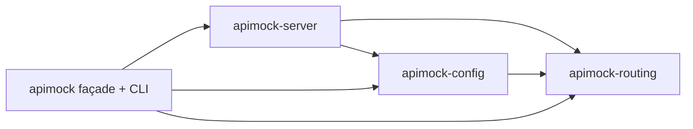

# Architecture

apimock-rs is a Cargo workspace of four crates under `crates/`
(`Cargo.toml:26-33`), version `5.15.0`, edition `2024`, MSRV `1.91.0`
(`Cargo.toml` `[workspace.package]`).

| Crate | Responsible for |
|---|---|
| [`apimock-routing`](#apimock-routing) | Rule-set model, request matching, read-only views |
| [`apimock-config`](#apimock-config) | `apimock.toml` loading/validation, the `Workspace` config-editing API |
| [`apimock-server`](#apimock-server) | The HTTP(S) listener, request dispatch, Rhai middleware, response building |
| [`apimock`](#apimock-façade--cli) | Façade re-export + the `apimock` binary |

## Dependency direction

A one-way graph rooted at `apimock-routing` — no crate depends back up
it:



Not a strict three-link chain: `apimock-server` depends on
`apimock-config` **and** `apimock-routing` directly, not only
transitively through config. `apimock-server`'s own module doc states
the split plainly: rule-set *matching logic* lives in
`apimock-routing`; config parsing and validation lives in
`apimock-config` (`crates/apimock-server/src/lib.rs:11-13`).

## `apimock-routing`

Depends on no other workspace crate (`crates/apimock-routing/Cargo.toml:13-24`
has no `apimock-*` line). Owns the rule-set schema (`rule_set.rs`),
matching (`strategy.rs`), and read-only views for external tooling
(`view/`).

```
crates/apimock-routing/src/
├── error.rs
├── lib.rs
├── parsed_request.rs
├── rule_set.rs      rule_set/
├── strategy.rs
├── util.rs          util/
└── view.rs          view/
```

## `apimock-config`

Depends on `apimock-routing` only (`crates/apimock-config/Cargo.toml:16`;
the comment there is explicit: *"Rule-set parsing is delegated to the
routing crate because the rule model lives there — the config crate
only orchestrates loading."*). Owns `apimock.toml` loading/validation
(`config.rs`) and the GUI-facing config-editing API (`workspace.rs`).

```
crates/apimock-config/src/
├── config.rs      config/
├── error.rs
├── lib.rs
├── path_util.rs   path_util/
├── toml_writer.rs
├── view.rs
└── workspace.rs   workspace/
```

## `apimock-server`

Depends on both `apimock-config` and `apimock-routing`
(`crates/apimock-server/Cargo.toml:14-15`). Owns the listener
(`server.rs`, `tls.rs`), request dispatch (see
[Matching order and precedence](./matching-order-and-precedence.md)),
Rhai middleware (`middleware.rs`), and response construction
(`response.rs`, `response_handler.rs`).

```
crates/apimock-server/src/
├── constant.rs
├── control.rs
├── dyn_route.rs
├── error.rs
├── http_util.rs
├── json_path_util.rs
├── lib.rs
├── middleware.rs        middleware/
├── parsed_request.rs
├── respond_response.rs
├── respond_util.rs
├── response.rs           response/
├── response_handler.rs
├── server.rs
├── tls.rs
└── trace.rs
```

## `apimock` façade + CLI

Depends on all three (`crates/apimock/Cargo.toml:18-21`). Both a
library and a binary: `src/lib.rs` re-exports the other three crates
under short aliases —

```rust
pub use apimock_config as config;
pub use apimock_routing as routing;
pub use apimock_server as server;
```

(`crates/apimock/src/lib.rs:31-33`) — and `src/main.rs` is the `apimock`
binary's entry point, consuming that same library crate. There's no
explicit `[[bin]]` section; the binary target is Cargo's implicit
convention from `src/main.rs`.

```
crates/apimock/src/
├── app.rs
├── args.rs      args/
├── cmd/         (match_test.rs, validate.rs)
├── lib.rs
├── logger.rs
└── main.rs
```

A `spawn` feature (`crates/apimock/Cargo.toml:14-16`, off by default)
adds an alternate constructor that forwards log output to an embedding
process over an `mpsc::Sender<String>` — for running `apimock` as a
subprocess of something else, rather than as a standalone CLI.

## History

Version `5.0.0` split the previously monolithic codebase into this
four-crate structure (`CHANGELOG.md`, `## [5.0.0]`). Version `5.1.1`
moved each crate — including the façade, which had briefly stayed
co-located with the workspace root — into its own directory under
`crates/` (`CHANGELOG.md`, `## [5.1.1]`), which is the layout described
above. Neither `src/config.rs`, `src/server.rs`, nor
`src/core/server/routing.rs` — paths from before the split — exist
anywhere in the repository today.
