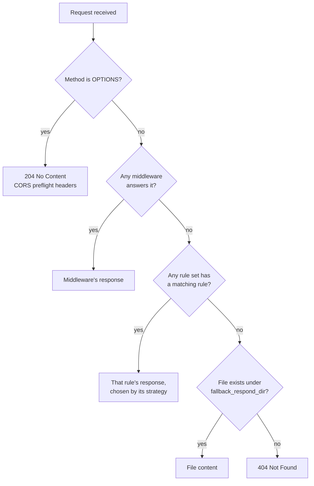

# Response decision flow

A diagram view of [Matching order and precedence](./matching-order-and-precedence.md) — start there for the prose explanation and the code citations behind it.

Each middleware script is tried in the order it's listed; the first
one that returns a value wins. Each rule set is tried in the order
it's listed; the first one with a matching rule wins, and that rule
set's `strategy` decides which of its own matching rules answers. See
[Vary the response for one path](../guides/vary-the-response-for-one-path.md)
for the five strategies.
